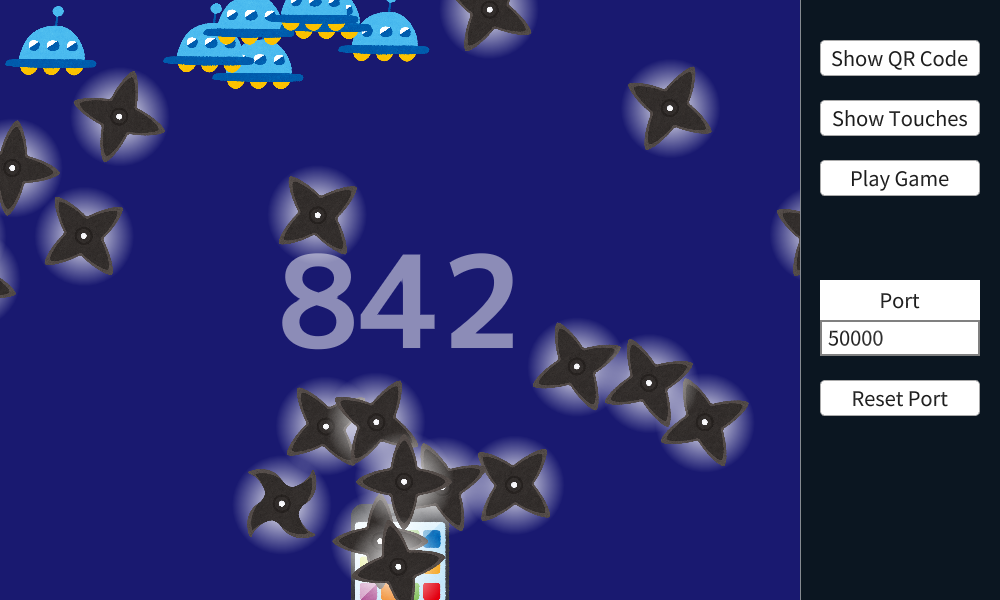

# Shuriken Connect

スマホから HTTP 通信でタッチ情報を取得する [Siv3D](https://siv3d.github.io/) のプログラムです。

スマホからのタッチ情報取得をほかのプロジェクトで利用する際は、 [ShurikenConnect/](https://github.com/Raclamusi/ShurikenConnect/tree/main/ShurikenConnect) にある SPTouch.hpp, SPInput.hpp, SPInput.cpp をそれぞれプロジェクトに加えてください。
これらのファイルは MIT License で公開しています。

使い方は [ShurikenConnect/Main.cpp](https://github.com/Raclamusi/ShurikenConnect/blob/main/ShurikenConnect/Main.cpp) やヘッダのコメントを参考にしてください。

## サンプル (ShurikenConnect/Main.cpp)

### QRコード

### タッチ確認

### サンプルゲーム

